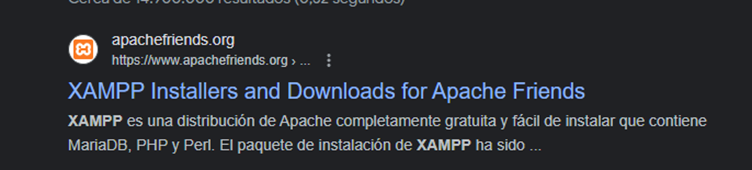
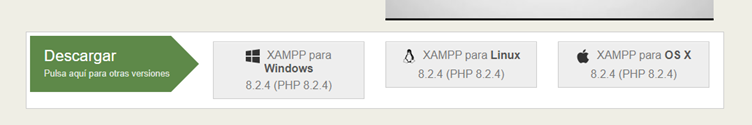
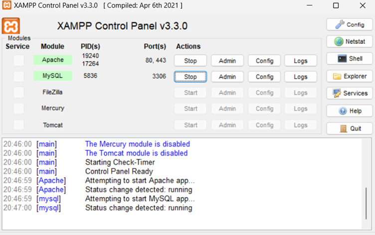
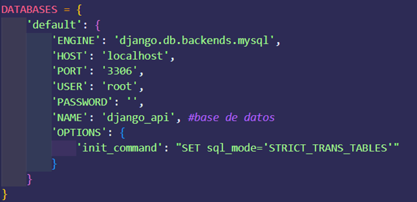
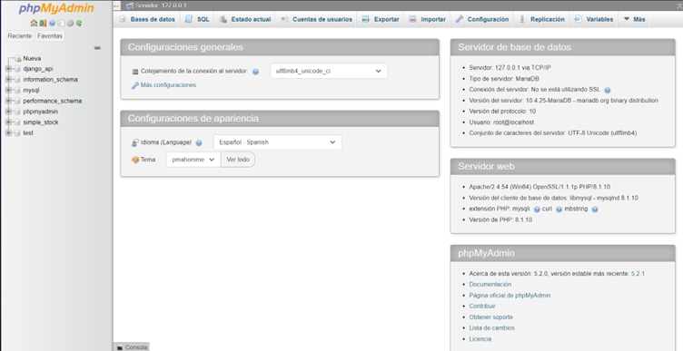
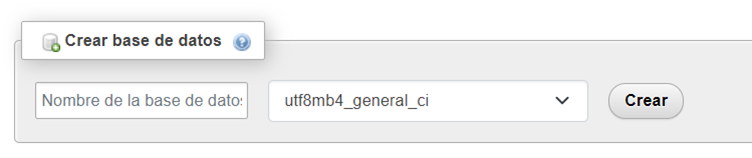

# API Rest Heladeria

# Descripcion
Esta es una api rest de una distribuidora de helados artesanales

# Tecnologias
- Python 3.10.9
- Django 4.0.4
- Rest Framework de django 3.13.1
- Base de datos relacional MySQL

# Instalacion de dependencias
Para iniciar el proyectos, primero tenemos que instalar las dependencias del proyecto de django, se adjunta un archivo llamado requirements.txt con todas las dependencias necesarias.

Para instalar estas dependencias en la terminal ingresar:

    activate.bat

Esto servira para instalar las dependencias e instalar y activar el entorno virtual.

# Instalar Xampp y ingresar el puerto en nuestro proyecto.
En el google buscar xampp, y ingresar en el primer link.

Descargar la version que nos acomode segun nuestro computador.

Una vez descargado, hacer doble click al archivo y ingresar next hasta el final.

Una vez ya instalado, lo ejecutamos y iniciamos apache y MySQL

El puerto del mysql, lo ingresamos en nuestro proyecto.

este lo encontramos en el settings.py.

# Crear la Base de datos
Ingresar en el apartado admin que sale en el xampp.

Esto nos llevara a una pagina web de localhost 

Una ves en la pagina ingresar donde dice nueva o en base de datos. Al hacer esto nos saldra un apartado en donde tenemos que escribir el nombre de nuestra base de datos que ingresamos en el archivo settings.py.

Al ingresar el nombre de la base de datos, luego de esto apretamos el boton de crear.

Al momento de crear la base de datos, esta va a estar vacia.

# Migraciones
Primero identificar si hay modelos creados, si hay modelos ingresar el siguiente comando:

    python manage.py makemigrations

Para identificar los modelos creados. Despues de esto ingresar el siguiente comando:

    python manage.py migrate

Para migrar los modelos a la base de datos.

# Ejecución
Ya que el entorno virtual ya esta activado y las dependencias intaladas, ejecute el siguiente comando para iniciar el proyecto:

    python manage.py runserver (numero de puerto opcional)

El numero de puerto es opcional. Si no ingresa ningun puerto, por defecto el proyecto se ejecutara en el puerto 8000 en el localhost.

